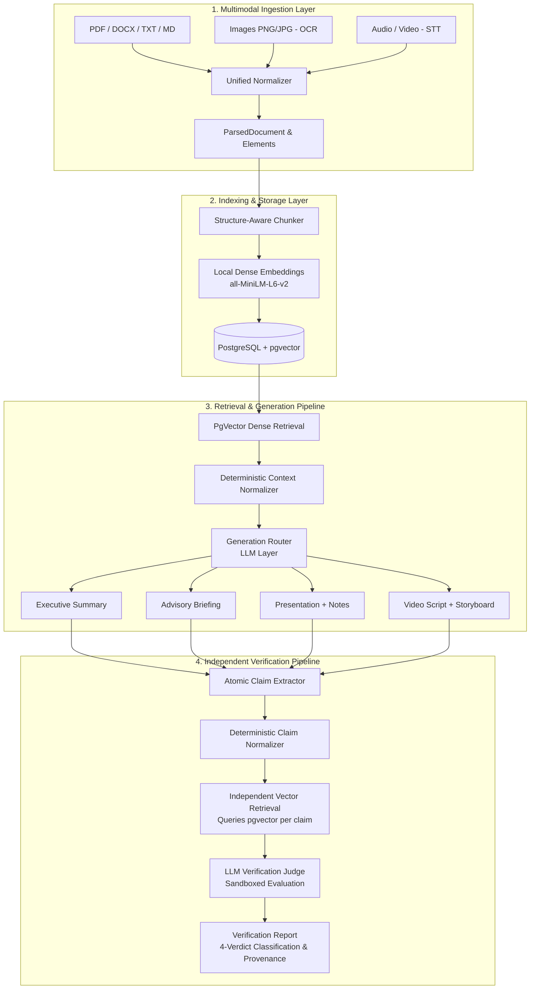

# TransformAI

> **Source-Grounded Generative AI for Multi-Format Content Transformation**  
> A research-oriented platform for factual, provenance-preserving multi-format content synthesis and independent claim verification.

---

## Overview

Transforming a single dense source document (e.g., technical reports, legal rulings, research articles, policy briefs) into distinct audience-specific communication formats—such as executive summaries, advisory briefings, slide presentations, and video scripts—is an essential but labour-intensive task. 

While Large Language Models (LLMs) can generate text in diverse formats, standard direct generation approaches frequently introduce factual inconsistencies, hallucinations, entity misattributions, and omitted core propositions. **TransformAI** is an academic research platform designed to investigate and quantify the factual consistency, semantic preservation, and retrieval-grounding of automated content transformations across varied architectures and modalities.

---

## Research Question

> **Central Research Question**:  
> *"How can generative AI transform a common source document into multiple communication formats while preserving factual consistency, semantic meaning, and source-groundedness?"*

Sub-questions addressed:
- Does retrieval-augmented generation (RAG) combined with deterministic context normalization improve factual grounding over direct prompt execution?
- Can post-hoc LLM-based claim verification reliably categorize factual statements into a four-class taxonomy (`SUPPORTED`, `CONTRADICTED`, `PARTIALLY_SUPPORTED`, `INSUFFICIENT_EVIDENCE`) using independently retrieved source evidence?
- What are the operational latency and computational trade-offs of multi-stage RAG, structured context normalization, and per-claim verification pipelines?

---

## Key Contributions

- **Multimodal Source Ingestion**: Deterministic parsing and metadata extraction across text (PDF, DOCX, TXT, Markdown), visual images (OCR), and audio/video containers into a unified normalized representation (`ParsedDocument`).
- **Structure-Aware Document Intelligence**: Semantic boundary-preserving chunking with heading hierarchy detection and local dense vector representations (`all-MiniLM-L6-v2`) indexed in PostgreSQL (`pgvector`).
- **Source-Grounded RAG & Context Normalization**: Decoupled context builder extracting atomic propositions, key entities, and citation anchors without generative hallucination.
- **Multi-Format Synthesis Router**: Schema-enforced generation pipelines for Executive Summaries, Advisories, Presentation Decks with Speaker Notes, and Video Scripts with Storyboards.
- **Independent Claim-Level Verification Agent**: Post-hoc factual verifier that deconstructs generated outputs into atomic claims, executes independent vector searches per claim (eliminating self-confirmation bias), and classifies groundedness into a four-verdict taxonomy.
- **Rigorous Quantitative Evaluation Harness**: Full-factorial empirical benchmark on real news corpora evaluated against 67 human-annotated ground-truth facts and 25 verification benchmark items with paired inferential statistics and multiple-testing corrections.

---

## System Architecture



---

## Processing Pipeline

The end-to-end transformation workflow strictly decouples generation from post-hoc verification:

1. **Source Input**: Ingests raw documents or media streams.
2. **Parsing & Modality Normalization**: Extracts text, page numbers, timestamps, section headers, and bounding boxes into `DocumentElement` structures.
3. **Structure-Aware Chunking**: Splits elements along paragraph and heading boundaries rather than arbitrary token lengths.
4. **Embedding Generation**: Computes 384-dimensional dense semantic embeddings using local `SentenceTransformers`.
5. **pgvector Storage**: Persists document vectors into PostgreSQL with cosine distance indexing.
6. **Semantic Retrieval**: Queries indexed chunks using cosine similarity ($1 - \text{cosine\_distance}$).
7. **Context Normalization**: Synthesizes retrieved passages into a structured context object with fact spans and entity anchors.
8. **Multi-Format Generation**: Routes normalized context to the designated format generator with JSON-schema constraints.
9. **Claim Extraction**: Deconstructs generated content into discrete atomic propositions.
10. **Independent Evidence Retrieval**: Executes fresh vector searches for each extracted claim against the original source document chunks (never reusing generation-time context).
11. **Claim-Evidence Verification**: Evaluates claims against retrieved passages inside sandboxed prompts to assign one of four verdicts (`SUPPORTED`, `CONTRADICTED`, `PARTIALLY_SUPPORTED`, `INSUFFICIENT_EVIDENCE`).
12. **Export & Evaluation**: Renders interactive provenance views and serializes structured verification reports.

---

## Supported Inputs

| Modality | Formats | Processing Engine | Provenance Preserved |
| :--- | :--- | :--- | :--- |
| **Text Documents** | `.pdf` | `pypdf` structural extraction | Page numbers, section titles, coordinates |
| **Word Processing** | `.docx` | `python-docx` | Heading hierarchy (H1–H3), table cells |
| **Plain Text** | `.txt`, `.md` | Deterministic stream parser | Paragraph offsets, line numbers |
| **Visual Images** | `.png`, `.jpg`, `.webp` | Pillow + `BaseOCRProvider` | Dimensions, bounding boxes, OCR confidence |
| **Audio** | `.mp3`, `.wav`, `.m4a` | `BaseTranscriptionProvider` | Timestamp ranges `[MM:SS - MM:SS]`, speakers |
| **Video** | `.mp4`, `.mov`, `.webm` | Dialogue audio STT + scene headers | Scene indices, container metadata, timestamps |

---

## Supported Outputs

| Output Format | Target Audience | Primary Content Structure | Key Export Capabilities |
| :--- | :--- | :--- | :--- |
| **Executive Summary** | Leadership / Executives | Strategic overview, core findings, grounded facts, implications | Markdown, JSON, PDF |
| **Advisory Briefing** | Operations / Analysts | Situation overview, key risks, recommended actions, notes | Markdown, JSON, PDF |
| **Presentation Deck** | Stakeholders / Audiences | Slide numbers, titles, bulleted takeaways, speaker scripts | Markdown, JSON, PPTX |
| **Video Script** | Media / Communications | Multi-scene storyboards, visual cues, voiceover narration | Markdown, JSON |

---

## Technology Stack

### Frontend
- **Framework**: Next.js 15 (React 19, TypeScript)
- **Styling**: Tailwind CSS, Lucide Icons
- **State & Client**: Type-safe API client, async status polling

### Backend
- **Framework**: FastAPI (Python 3.13)
- **Validation**: Pydantic v2 & `pydantic-settings`
- **Database ORM**: SQLAlchemy 2.0 (Async) with `asyncpg`

### Data & Retrieval
- **Vector Database**: PostgreSQL 16 with `pgvector` extension
- **Caching & Brokering**: Redis 7
- **Embedding Model**: `SentenceTransformers` (`all-MiniLM-L6-v2`, 384 dimensions)

### AI & Verification
- **Provider Abstraction**: Decoupled `BaseLLMProvider`, `BaseOCRProvider`, `BaseTranscriptionProvider`
- **Active Experiment Model**: Local Ollama (`llama3.2` @ `http://localhost:11434/v1`)
- **Offline / CI Mode**: Deterministic mock providers for fully offline test execution

### Infrastructure
- **Containerization**: Docker & Docker Compose

---

## Research Methodology

TransformAI was evaluated across two quantitative empirical tracks and one operational telemetry track:

### Track 1: Generation Quality (Full-Factorial Benchmark)
- **Corpus**: 5 real news documents from the CNN/DailyMail dataset (`DOC-REAL-001` through `DOC-REAL-005`).
- **Ground Truth**: 67 human-annotated `FINAL` factual propositions with exact text-span character offsets.
- **Architectural Conditions**:
  - **Method A (Direct Prompting)**: Zero retrieval; full document supplied directly to the model.
  - **Method B (Basic RAG)**: Dense vector similarity search over structure-aware chunks; top passages injected into context.
  - **Method C (RAG + Context Normalization)**: Dense vector retrieval combined with deterministic fact extraction and structured context normalization.
- **Scope**: $5 \text{ documents} \times 4 \text{ formats} \times 3 \text{ methods} = \mathbf{60\text{ generation runs}}$.
- **Metrics**: Fully Supported Claim Rate (FSCR), Contradiction Rate (CR), Partial Support Rate (PSR), Source Groundedness (SG), Source Coverage (SC), Semantic Preservation (SP), and Generation Latency.

### Track 2: Verification Quality (4-Class Classification Benchmark)
- **Benchmark Corpus**: 25 `FINAL` ground-truth claim–evidence pairs across the 5 real documents.
- **Taxonomy**: `SUPPORTED` ($N=8$), `CONTRADICTED` ($N=7$), `PARTIALLY_SUPPORTED` ($N=4$), `INSUFFICIENT_EVIDENCE` ($N=6$).
- **Evaluator**: M6 LLM Claim Verifier operating with independent retrieval over source document chunks.
- **Metrics**: 4-class Accuracy, Macro-Precision, Macro-Recall, Macro-F1, Binary Accuracy, and Confusion Matrix.

### Track 3: Operational Telemetry
- Profiling end-to-end execution latency across Direct Prompting (A), Basic RAG (B), RAG + Context Normalization (C), and Per-Claim Verification (D).

---

## Experimental Results

### Track 1: Generation Quality Descriptive Statistics ($N = 20$ runs per method)

| Metric | Method A (Direct) Mean (Std) | Method B (Basic RAG) Mean (Std) | Method C (RAG + Context) Mean (Std) |
| :--- | :---: | :---: | :---: |
| **Fully Supported Claim Rate (FSCR)** | 0.2566 (0.2732) | 0.2866 (0.3268) | 0.2729 (0.3247) |
| **Contradiction Rate (CR)** | 0.3743 (0.2822) | 0.3504 (0.3096) | 0.3692 (0.3247) |
| **Partial Support Rate (PSR)** | 0.3691 (0.1709) | 0.3631 (0.1777) | 0.3579 (0.2082) |
| **Source Groundedness (SG)** | 0.4412 (0.2643) | 0.4681 (0.3057) | 0.4519 (0.3076) |
| **Source Coverage (SC)** | 0.1438 (0.1574) | 0.1806 (0.1879) | 0.1753 (0.1754) |
| **Semantic Preservation (SP)** | 0.1357 (0.1500) | 0.1822 (0.1904) | 0.1661 (0.1818) |
| **Generation Latency (seconds)** | 99.17s (22.56s) | 91.04s (17.61s) | 123.71s (26.15s) |

#### Statistical Hypothesis Testing Summary
- In this sample of 60 runs on `llama3.2`, Method B produced a higher sample mean FSCR (0.2866) and Source Coverage (0.1806) than Method A (0.2566 FSCR, 0.1438 SC).
- Paired Student's $t$-tests across the 12 pairwise comparisons yielded raw $p$-values ranging from $p = 0.0788$ (A vs B Semantic Preservation) to $p = 0.8244$ (B vs C Source Coverage).
- After **Holm-Bonferroni Family-Wise Error Rate (FWER) correction**, all adjusted $p$-values are $p_{\text{adj}} \ge 0.9456$, indicating that observed pairwise metric differences between Methods A, B, and C are not statistically significant at $\alpha = 0.05$.
- Paired **Wilcoxon signed-rank sensitivity tests** yielded concordant non-parametric decisions across all 12 comparisons ($p > 0.05$).

### Track 2: Verification Quality Benchmark Results ($N = 25$ items)

| Metric | Score | Scope / Notes |
| :--- | :---: | :--- |
| **4-Class Accuracy** | **0.5600** (14/25) | Multi-class overall accuracy |
| **Macro Precision** | **0.2841** | Unweighted mean across 4 classes |
| **Macro Recall** | **0.4688** | Unweighted mean across 4 classes |
| **Macro F1-Score** | **0.3509** | Harmonic mean of Macro P & R |
| **Binary Classification Accuracy** | **0.7200** (18/25) | Source-Supported vs Not-Supported |
| **Binary F1-Score** | **0.6957** | Binary entailment harmonic mean |
| **Mean Verification Latency** | **32.24s** (32,238.8 ms) | Per-claim independent verification |

#### Track 2 Per-Class Classification Breakdown

| Class Verdict | Support (Gold) | True Positives (TP) | False Positives (FP) | Precision | Recall | F1-Score |
| :--- | :---: | :---: | :---: | :---: | :---: | :---: |
| **SUPPORTED** | 8 | 7 | 4 | 0.6364 | 0.8750 | 0.7369 |
| **CONTRADICTED** | 7 | 7 | 7 | 0.5000 | 1.0000 | 0.6667 |
| **PARTIALLY_SUPPORTED** | 4 | 0 | 0 | 0.0000 | 0.0000 | 0.0000 |
| **INSUFFICIENT_EVIDENCE** | 6 | 0 | 0 | 0.0000 | 0.0000 | 0.0000 |

#### Track 2 Confusion Matrix
*Rows: Gold Expected Labels | Columns: Model Predictions*

| Gold \ Predicted | SUPPORTED | CONTRADICTED | PARTIALLY_SUPPORTED | INSUFFICIENT_EVIDENCE | Total |
| :--- | :---: | :---: | :---: | :---: | :---: |
| **SUPPORTED** | **7** | 1 | 0 | 0 | 8 |
| **CONTRADICTED** | 0 | **7** | 0 | 0 | 7 |
| **PARTIALLY_SUPPORTED** | 1 | 3 | **0** | 0 | 4 |
| **INSUFFICIENT_EVIDENCE** | 3 | 3 | 0 | **0** | 6 |

---

## Research Limitations

1. **Computational & Hardware Constraints**: Local execution on `llama3.2` (3.2B parameters) required an average of ~91–124 seconds per transformation and ~32.2 seconds per verified claim on standard CPU/local endpoints.
2. **Sample Size Scope**: The real research dataset comprises 5 documents ($N = 60$ generation runs) and 25 verification items. While sufficient for pilot hypothesis testing and non-parametric checks, larger corpora would be required to statistically resolve subtle effect sizes ($d < 0.30$).
3. **Verifier Boundary Collapse**: In this 25-item benchmark, the local LLM verifier collapsed compound assertions (`PARTIALLY_SUPPORTED`) and unmentioned claims (`INSUFFICIENT_EVIDENCE`) into binary decisions (`SUPPORTED` or `CONTRADICTED`), achieving 0.0 F1 on the intermediate classes while maintaining high recall on explicit support (87.5%) and contradiction (100.0%).
4. **Retrieval Metric Status**: Retrieval Recall@5, Precision@5, and MRR were formally designated as **unmeasured / null** in final research findings because the original ground-truth chunk relevance set was not independently annotated apart from the retrieved candidates.
5. **Model-Specific Generalizability**: All empirical figures reflect local execution using `llama3.2` and `all-MiniLM-L6-v2`. Results may differ under larger parameter models or alternate embedding dimensions.

---

## Project Structure

```
transform-ai/
├── backend/
│   ├── app/
│   │   ├── api/v1/          # Versioned REST endpoints (health, documents, retrieval, generation, verification, export)
│   │   ├── core/            # Config, database engine, Redis client
│   │   ├── models/          # SQLAlchemy async ORM models (Document, DocumentChunk)
│   │   ├── schemas/         # Pydantic validation schemas
│   │   └── services/        # Domain services: document parsing, chunking, embeddings, retrieval, generation, verification
│   └── tests/               # Pytest automated test suite (119 passing tests)
├── frontend/
│   ├── src/
│   │   ├── app/             # Next.js App Router & global styles
│   │   ├── components/      # UI components (TransformationWorkspace, VerificationInspector, ProvenanceDrawer)
│   │   └── lib/             # Typed API client
│   └── package.json
├── research/
│   ├── datasets/            # Real research dataset (5 source docs, 67 facts) & verification benchmark (25 items)
│   ├── experiments/         # Real experiment runners (run_real_experiment_60run.py, run_real_verification_25run.py)
│   ├── results/
│   │   ├── FINAL_RESEARCH_RESULTS.md   # Authoritative comprehensive research report
│   │   ├── FINAL_RESEARCH_TABLES.md    # Clean publication-ready tables
│   │   ├── final_research_summary.json # Consolidated machine-readable JSON dataset
│   │   ├── real_experiment_60run/      # 60 raw JSON observation files + processed metrics
│   │   └── real_verification_25run/    # 25 raw JSON verification files + processed metrics
│   └── methodology/         # Formal evaluation and annotation protocol documentation
├── docker-compose.yml       # Production/development orchestration (PostgreSQL pgvector, Redis, Backend, Frontend)
├── .env.example             # Environment configuration template
└── README.md
```

---

## Setup & Installation

### Prerequisites
- [Docker](https://docs.docker.com/get-docker/) & Docker Compose **or** Python 3.13+ and Node.js 18+
- [Ollama](https://ollama.com/) (if executing live local LLM inference with `llama3.2`)

### 1. Clone & Configure Environment
```bash
git clone https://github.com/samayita34/Gen-AI-Content-Transformer.git
cd Gen-AI-Content-Transformer
cp .env.example .env
```

Key environment configurations in `.env`:
```env
# LLM Provider: "openai_compatible" (for Ollama), "gemini", or "mock"
LLM_PROVIDER=openai_compatible
LLM_MODEL=llama3.2
OPENAI_API_BASE=http://localhost:11434/v1
LLM_TIMEOUT_SECONDS=300

# Embedding Provider
EMBEDDING_MODEL_NAME=all-MiniLM-L6-v2
EMBEDDING_DIMENSION=384
```

---

## Running the Application

### Option A: Docker Compose (Full Stack)
```bash
docker compose up --build
```
Services will be accessible at:
- **Frontend Workspace**: [http://localhost:3000](http://localhost:3000)
- **Backend Swagger API**: [http://localhost:8000/docs](http://localhost:8000/docs)
- **Health Probe**: [http://localhost:8000/api/v1/health](http://localhost:8000/api/v1/health)

### Option B: Local Development

#### 1. Start Database & Cache
```bash
docker compose up -d postgres redis
```

#### 2. Start Backend
```bash
cd backend
python -m venv .venv
# Windows:
.venv\Scripts\activate
# Linux/macOS:
source .venv/bin/activate

pip install -r requirements.txt
uvicorn app.main:app --reload --host 0.0.0.0 --port 8000
```

#### 3. Start Frontend
```bash
cd frontend
npm install
npm run dev
```

---

## Running Automated Tests

Execute the full backend automated test suite (119 unit, integration, and regression tests):

```bash
python -m pytest backend/tests/
```

---

## Research Reproducibility

All empirical data, experimental runners, ground-truth annotations, and statistical calculation pipelines are archived in the repository for reproducibility:

- **Canonical Annotation Protocol**: [`research/methodology/real_research_annotation_protocol.md`](file:///c:/genai/research/methodology/real_research_annotation_protocol.md)
- **Track 1 Experiment Runner**: [`research/experiments/run_real_experiment_60run.py`](file:///c:/genai/research/experiments/run_real_experiment_60run.py)
- **Track 2 Verification Runner**: [`research/experiments/run_real_verification_25run.py`](file:///c:/genai/research/experiments/run_real_verification_25run.py)
- **Statistical Scoring Engine**: [`research/experiments/statistical_analysis.py`](file:///c:/genai/research/experiments/statistical_analysis.py)
- **Raw Observations**:
  - Track 1 ($N=60$): [`research/results/real_experiment_60run/raw/`](file:///c:/genai/research/results/real_experiment_60run/raw/)
  - Track 2 ($N=25$): [`research/results/real_verification_25run/raw/`](file:///c:/genai/research/results/real_verification_25run/raw/)
- **Authoritative Reports**:
  - Comprehensive Report: [`research/results/FINAL_RESEARCH_RESULTS.md`](file:///c:/genai/research/results/FINAL_RESEARCH_RESULTS.md)
  - Tables Document: [`research/results/FINAL_RESEARCH_TABLES.md`](file:///c:/genai/research/results/FINAL_RESEARCH_TABLES.md)
  - Consolidated JSON: [`research/results/final_research_summary.json`](file:///c:/genai/research/results/final_research_summary.json)

---

## Research Status

- [x] **Track 1 Real Generation Benchmark**: Completed across 60 live generation runs with 67 ground-truth facts.
- [x] **Track 2 Real Verification Benchmark**: Completed across 25 gold benchmark items with 4-class evaluation.
- [x] **Track 3 Operational Telemetry**: Completed across conditions A, B, C, and D.
- [x] **Inferential Statistical Analysis**: Paired Student's $t$-tests, Holm-Bonferroni FWER adjustments, and Wilcoxon signed-rank sensitivity tests verified.
- [x] **Dataset Partitioning**: Development fixture documents are strictly isolated from real research datasets.
- [x] **Regression & Suite Integrity**: 119/119 backend automated tests passing.
